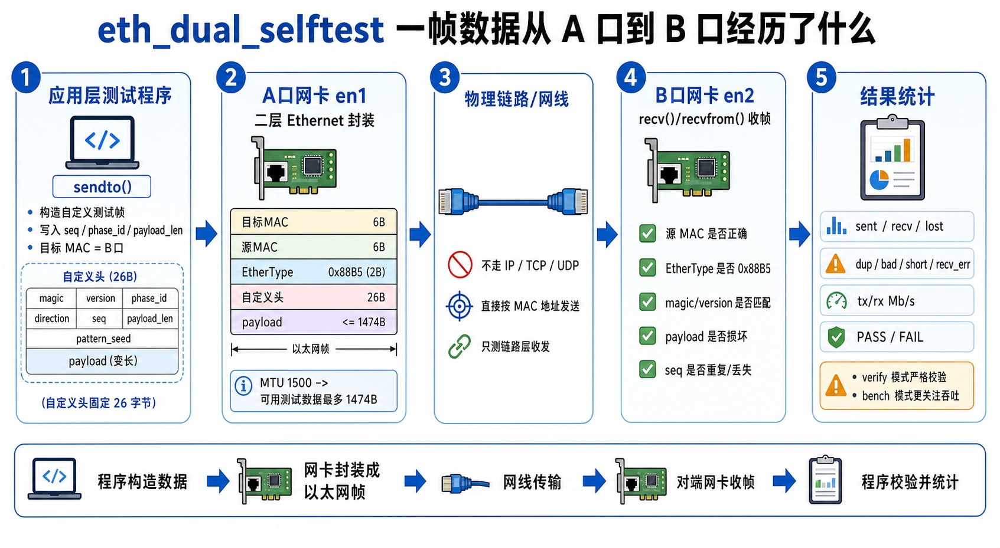

# DEV-TOOLS-SUITE

SylixOS 开发辅助工具集，包含板卡调试、文件上传、寄存器读取等常用小工具。

## 目录概览

| 路径 | 说明 |
|------|------|
| `telnet_interrupt_monitor/` | 通过 Telnet 周期性监测目标 IRQ 中断计数 |
| `ftp_sylixos_upload/` | 将文件上传到 SylixOS 板卡 |
| `readreg/` | 在 Linux 或 SylixOS 下读取寄存器值，用于调试和对比 |
| `eth_dual_selftest/` | SylixOS 单板双网口原始二层自测用例，区分物理链路验证与吞吐基准 |

---

## telnet_interrupt_monitor

通过 Telnet 循环连接指定设备，定期执行 `ints` 命令监测目标 IRQ 的中断次数。如果两次计数的值相同，则弹出系统警告（表示该 IRQ 可能停止了）。

> ⚠️ **仅支持 Windows 环境**（使用 Windows API 弹窗）

### 使用方法

修改脚本末尾的默认配置：

```python
TARGET_HOST = "10.13.21.42"      # 目标设备 IP
LOGIN_USERNAME = "root"         # 用户名
LOGIN_PASSWORD = "root"         # 密码
EXECUTE_COMMAND = "ints"        # 查询命令
TARGET_IRQ_NAME = "uart2_isr"   # 要监测的 IRQ 名称
CYCLE_INTERVAL_MINUTES = 1     # 轮询间隔（分钟）
```

直接运行脚本：

```bash
./telnet_interrupt_monitor/telnet_interrupt_monitor.py
```

按 `Ctrl+C` 可手动终止。

---

## ftp_sylixos_upload

FTP 上传工具，用于手动上传文件到 SylixOS 板卡。

> ⚠️ **主要在 Linux 环境下使用**

当前脚本兼容以下 `.reproject` 本地路径风格：

- `$(WORKSPACE_project)/build/<PLATFORM>/Release/...`
- `$(WORKSPACE_project)/$(Output)/...`
- 旧工程常见的项目根目录 `Release/...` 或 `Debug/...`

脚本会优先结合 `.reproject` 的 `DeviceSetting/@Platform`、`config.mk` 的
`PLATFORMS`/`DEBUG_LEVEL` 和当前 `build/` 目录来解析真实本地产物路径。

### 使用方法

```bash
# 自动解析项目 .reproject 并上传（推荐）
./ftp_sylixos_upload/ftp_sylixos_upload.py -P /path/to/project

# 使用当前目录的 .reproject
./ftp_sylixos_upload/ftp_sylixos_upload.py -P .

# 指定板卡 IP（覆盖 .reproject 中的配置）
./ftp_sylixos_upload/ftp_sylixos_upload.py -P . -i 10.13.21.100

# 上传单个文件
./ftp_sylixos_upload/ftp_sylixos_upload.py -i 10.13.21.42 -f lyn_drv.ko -t /lib/modules/drivers/lyn_drv.ko

# 上传到指定目录（保持文件名）
./ftp_sylixos_upload/ftp_sylixos_upload.py -i 10.13.21.42 -f liblyn_drv.so -d /lib/

# 使用自定义凭证
./ftp_sylixos_upload/ftp_sylixos_upload.py -i 10.13.21.42 -u admin -p admin123 -f test.ko -t /lib/modules/test.ko

# 批量上传（使用配置文件）
./ftp_sylixos_upload/ftp_sylixos_upload.py -i 10.13.21.42 -c upload_list.txt
```

### 参数说明

| 参数 | 说明 |
|------|------|
| `-P, --project` | 项目目录路径（自动解析 .reproject） |
| `-i, --ip` | 板卡 IP 地址 |
| `-u, --user` | FTP 用户名（默认: root） |
| `-p, --password` | FTP 密码（默认: root） |
| `-f, --file` | 本地文件路径 |
| `-t, --target` | 目标文件路径（完整路径） |
| `-d, --dir` | 目标目录（保持原文件名） |
| `-c, --config` | 配置文件（每行格式: 本地路径\|目标路径） |

---

## readreg

用于在 Linux 或 SylixOS 命令行下直接读取寄存器值，便于对比两边同一寄存器地址的实际内容。

### 文件说明

| 文件 | 说明 |
|------|------|
| `readreg/readreg_linux.c` | Linux 版本，通过 `/dev/mem + mmap` 读取物理地址 |
| `readreg/readreg_sylixos.c` | SylixOS 版本，通过直接解引用寄存器地址读取 |

### 编译方式

Linux：

```bash
gcc -O2 -Wall -Wextra -o readreg_linux readreg/readreg_linux.c
```

SylixOS：

```bash
${CROSS_COMPILE}gcc -O2 -Wall -Wextra -o readreg_sylixos readreg/readreg_sylixos.c
```

也可以将 `readreg/readreg_sylixos.c` 复制到 SylixOS IDE 工程中编译。

### Linux 使用方法

```bash
# 读取单个 32 位寄存器（默认 32 位）
./readreg_linux 0xfdc60068

# 按 16 位读取
./readreg_linux 0xfdc60068 16

# 连续读取 4 个 32 位寄存器
./readreg_linux 0xfdc60068 32 4
```

### SylixOS 使用方法

```bash
# 读取单个 32 位寄存器（默认 32 位）
./readreg_sylixos 0xfdc60068

# 按 16 位读取
./readreg_sylixos 0xfdc60068 16

# 连续读取 4 个 32 位寄存器
./readreg_sylixos 0xfdc60068 32 4
```

### 参数说明

`readreg_linux`：

| 参数 | 说明 |
|------|------|
| `phys_addr` | 要读取的物理寄存器地址，支持十进制或 `0x` 前缀十六进制 |
| `width` | 访问位宽，可选 `8`、`16`、`32`、`64`，默认 `32` |
| `count` | 连续读取的寄存器个数，默认 `1`。每次按 `width / 8` 递增地址 |

`readreg_sylixos`：

| 参数 | 说明 |
|------|------|
| `addr` | 寄存器地址，支持十进制或 `0x` 前缀十六进制 |
| `width` | 访问位宽，可选 `8`、`16`、`32`、`64`，默认 `32` |
| `count` | 连续读取的寄存器个数，默认 `1`。每次按 `width / 8` 递增地址 |


### 注意事项

- `readreg_linux` 依赖 `/dev/mem`，某些 Linux 内核启用了严格的 `/dev/mem` 访问限制，程序即使编译成功也可能无法读取目标地址。
- `readreg_linux` 适用于 Linux 下的 MMIO 物理地址读取，不适用于 I2C、SPI 等非直接物理映射寄存器。
- `readreg_sylixos` 的前提是当前 SylixOS 环境允许像 `*(volatile unsigned int *)0xfdc60068` 这样直接访问目标地址。
- 某些寄存器存在“读清零”或其他读副作用，读取前需要先确认芯片手册。
- 地址和访问位宽应与寄存器定义一致，否则可能读到错误值，甚至触发异常。

### Tips

Linux 下若不支持 SSH 文件传输，可使用 `wget` 命令下载：

电脑端开启临时文件服务器：

```bash
python -m http.server 8888
```

将待传输文件放在启动命令时所在的目录下。

板卡端下载文件：

```bash
wget http://电脑ip:8888/file
```

---

## eth_dual_selftest

用于 **SylixOS 单板双网口直连** 场景下的网络自测工具，适合在 **没有陪测机** 的情况下，快速验证板卡当前双网口网络配置和链路状态是否正常。

该工具适用于：

- 一块板卡上有两个以太网口
- 两个网口之间通过网线直连
- 需要在板端直接测试网络是否可用
- 没有额外 PC 或服务器作为陪测机

### 文件说明

| 文件 | 说明 |
|------|------|
| `eth_dual_selftest/eth_dual_selftest.c` | SylixOS 版本单板双网口自测工具源码 |

### 测试流程图



### 主要模式

- `verify`
  适合做“配置是否正常、链路是否稳定”的验证模式。更强调验证结果的可靠性。

- `bench`
  适合做“当前双网口直连场景下，大致能跑到多大吞吐”的基准模式。更强调速度观测。

### 编译方式

该源码面向 SylixOS 工程环境使用，通常做法是：

1. 将 `eth_dual_selftest.c` 放入 SylixOS App 工程
2. 使用项目已有的 `config.mk + multi-platform.mk` 构建

如使用交叉编译器单独编译，需确保包含：

- `SylixOS.h`
- `netpacket/packet.h`
- `net/if_arp.h`

以及 SylixOS 的网络头文件搜索路径。

### 使用方法

默认运行：

```bash
./eth_dual_selftest
```

默认模式为 `bench`。

常见用法：

```bash
# 跑吞吐基准模式，持续 10 秒
./eth_dual_selftest -d 10

# 跑验证模式，持续 5 秒
./eth_dual_selftest -m verify -d 5

# 指定两个网口名
./eth_dual_selftest -a en1 -b en2 -m verify -d 5

# 指定单次测试 payload 大小
./eth_dual_selftest -m bench -d 10 -sl 1472
```

### 参数说明

| 参数 | 说明 |
|------|------|
| `-a <ifname>` | 指定网口 A，默认 `en1` |
| `-b <ifname>` | 指定网口 B，默认 `en2` |
| `-m <mode>` | 测试模式，可选 `verify` 或 `bench`，默认 `bench` |
| `-d <sec>` | 每个阶段持续时间（秒）。设置后按时长运行 |
| `-sc <count>` | 在未指定 `-d` 时，单方向发送的数据包数量 |
| `-sl <bytes>` | 单方向测试 payload 大小 |
| `-sg <usec>` | `verify` 模式下发送间隔（微秒） |
| `-t <msec>` | 发送结束后接收等待超时（毫秒） |

### 使用建议

- 如果目的是先确认“当前网络配置和链路状态是否正常”，优先使用：

```bash
./eth_dual_selftest -m verify -d 5
```

- 如果目的是看“大致吞吐能力”，优先使用：

```bash
./eth_dual_selftest -d 10
```

- 运行前请确保两个网口已经直连，且接口处于 `UP` / `RUNNING` 状态。

### 典型场景

- 板卡出厂前的单板双口网络自检
- 无陪测机条件下的网络配置快速验证
- 现场调试时快速确认两个网口是否工作正常
- 粗略观测双口直连场景下的板端吞吐水平

---
